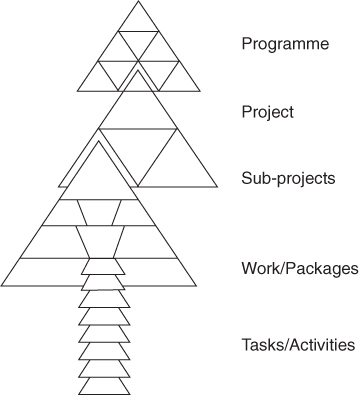
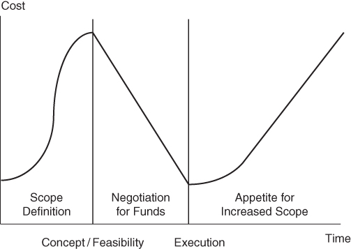
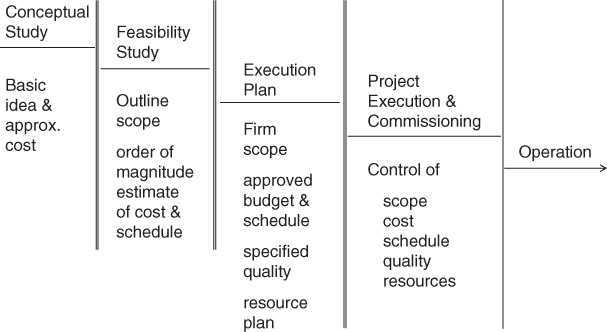
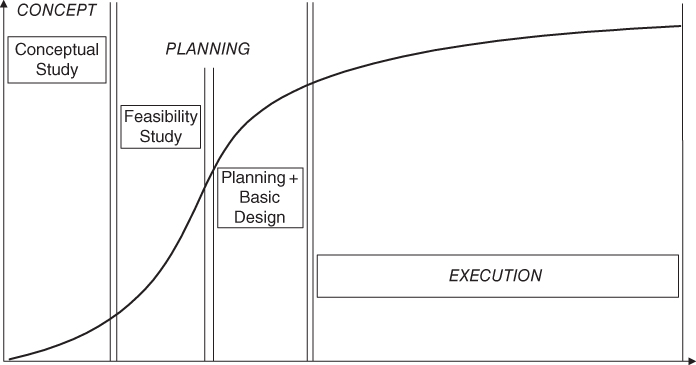
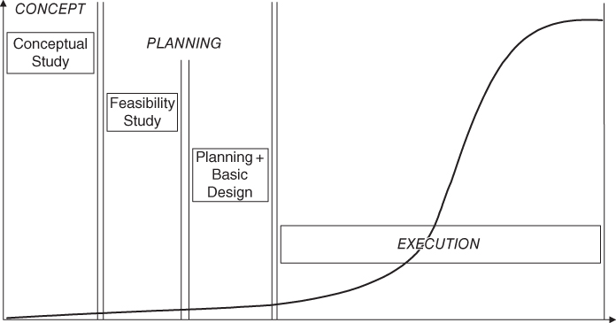
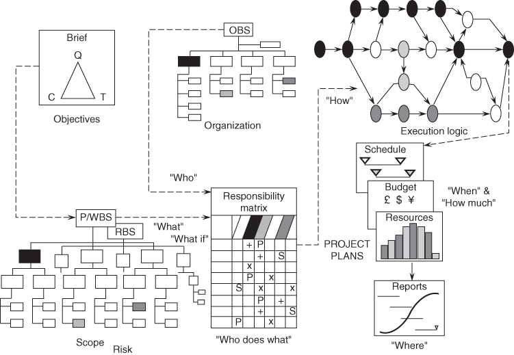
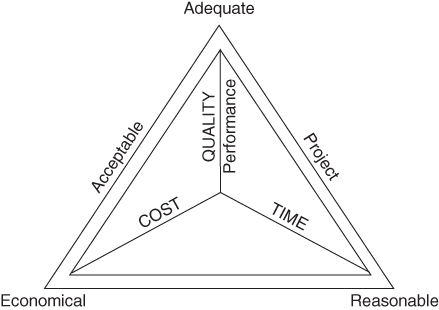
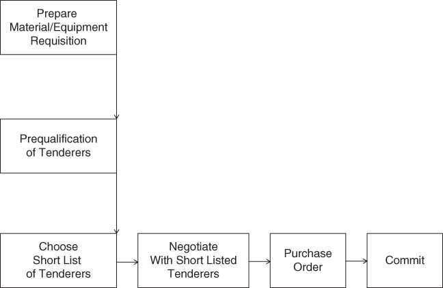
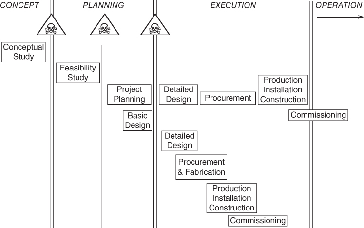

# SECTION A. 프로젝트의 특성과 단계

다음 중 프로젝트가 아닌것은?

- 자금 조달 
- 정보 시스템
- 인공지능 연구
- 회사 합병
- 조직 변경
- 제품 출시
- 기계 해체
- 건강 케어

> 프로젝트는 변화가 반드시 따른다

저항이 따르기 마련 ==> PM의 리더십이 필요 ==> 프로젝트 매니지 프로세스가 필요해짐

### 프로젝트 크기와 복잡도에 따른 계층

- 가장 낮은 수준이 **루틴** - 가장 일상적이며 리스크나 어려음이 없이 수행하는 task
- **워크 패키지**- 자주 생기는 작은 프로젝트. 큰 리스크나 특별한 전문성이 필요없음. **런너**라고도 부름

> 정기적으로 회사에서 비슷한 형식으로 수행하는 **프로젝트** - **리피터**라고도 부름

- 실패할 위험이 크다.
- 경험있고 기술이 있는프로젝트 관리자가 필요.

>‘모든 프로젝트는 종이에서 이상적이고 완벽한 비전으로 시작한다. 곧이어 비용의 혼동, 크기와 님비의 반대를 직면한다. 2 따라서 최상의 방법은 타당성 프로젯트를 먼저 수행하여 요구사항을 명료하게 정리하여야 한다.(see Part III). 그러나 규모와 관계없이 공통적인 특징들이 있다.

## 1. 프로젝트의 특성

* 프로젝트는 반복적이지 않다.

* 아이디어가 산출물로 나타나는 단계가 존재한다.

* 프로젝트의 고유성 때문에 반드시 리스크가 존재한다.

* 투자 대비 이득이 무엇인지 즉, 비즈니스 목표가 있다.

* 변경이 쉽다

    - 비즈니스 또는 시장의 상황이 변화하므로 프로젝트는 범위가 많이 달라진다
    - 프로젝트가 재정적으로 살아남으려면 비용을 줄여야 한다. ==> 범위를 줄여야 한다는 뜻
    - 아이디어는 크지만 예산이 한정되므로 아이디어는 축소되야 한다.

* 고객은 비용은 줄이지만 야망을 줄이지 않는다.    - 
    - 실제로 변경이 없는 고객은 없다
    - 모든 변경 작업은 비즈니스 목표의 실패를 유발하기 쉽다.
    - 대부분 도달하기 어려운 목표에 부족한 비용을 책정
    - **올바른 방법**은 "필수적인 기능"을 만들고 "있으면 좋을 기능"은 비용이 남았을때 완료
    

## 2. 단계

프로젝트는 여러 단계 또는 스테이지로 모델링한다.

단계를 순차적 또는 중첩하여 실행하기도 한다.

Thinking - (기획) - 실행

#### (1) 씽킹 단계

생각 단계는 즐기는 단계이다.

실행도 마찬가지. 디자인하고 만들고 구축하는 것을 좋아한다.

>그러나 **Planning**은 아니다. 기획은 자연스런 과정이 아니다.

플래닝은 프로젝트 관리 프로세스로 개발되어야 한다. 

문제는 생각한 것을 바로 구현(doing)단계로 간다는 것이다.
==> 프로젝트가 재앙이 된다는 뜻이다.

이것은 프로젝트의 특성이 결함이 있다는 것이 아니라 프로젝트 관리의 실패를 의미한다.

#### (2) 상세한 단계

프로젝트 각 단계의 상태를 

1. 컨셉  - 새로운 기능, 공장, 제품 요구사항이 있다.
2. 구현 가능성 - 실현 가능헌지, 비즈니스에 적절한지 판단
3. 플래닝 - 타당성이 있다면 수행 계획을 수립
4. 기초적인 설계
5. 설계/ 디자인
6. 조달 - 필요한 서비스, 재료, 장비 등 구매
7. 구축 또는 생산
8. 설치 또는 deploy

#### 구매와 계약 단계

이후의 단계를 수행할때 누군가와 계약하는 단계의 위치에는 3가지가 있다

1. 개념 연구와 가능성 연구의 끝에서
2. 기본 설계와 계획 단계 전에
3. 프로젝트 실행 단계 전에

## 3. 프로젝트 패턴

### 결정이 비용에 미치는 영향

가능성 테스트 동안에 다른 대안이 검토된다. 경영진에서 최종 연구를 수락하면 작업 비용은 타당한 여유가 생김.

기본 개념이 유지된다고 가정할 때 15% 이상을 절감하기는 거의 불가능하다.

비용 영향의 85%는 앞쪽 단계에서 결정된다.

### 이행 약속

초기 단계에서의 재정적 이행 약속은 일단 생산 작업이 수행될 때의 비용과 비교해 매우 작다.

가능성 검토 단계에서 프로젝트에 대한 접근 방법을 전체적으로 바꾸는 것이 훨씬 저렴하다.

## 4. 프로잭트 타당성

프로젝트를 수행하는 이유

1. ROI
2. 전략 목표를 달성
3. 법규 준수 - 보안, 환경, 금융 등
4. 정치적 사회적인 이유
5. 'Ego/Vanity' 프로젝트 - 회사 시니어가 시키는 내부 과제. 가능하면 피할 것

## 5. 프로젝트 니즈

1. 목표가 분명하고 완뱍한 정의가 필요
2. 재정적으로 탄탄
3. 정치적 안정성과 확신
4. 가장 빠른 수행 프로그램으로
5. 능력있고 경험있는 PM이 필요

# SECTION B. 프로젝트 관리의 특성

*Project Management is the multidisciplinary process of achieving a satisfactory end result.*

'multidisciplinary'는 복잡한 관계와 매트릭스 형태의 구조를 만든다.

--> 이것이 개별적인 기능적 규범과 프로젝트 관리가 다른 점이다.

이것은 툴이나 기술이 아니라 작업 프로세스이다.

**성공적인 프로젝트 관리**는 최상의 결과를 만드는 것이 아니라 **예산과 일정** 범위에서 적당한 것을 만드는 것이다

- 프로젝트 관리는 빛나는 아이디어를 실체로 만드는 것이며 최종 결과를 만드는 수단일 뿐이다.
- 프로젝트 관리 개념에 헌신하는 것이 프로젝트 성공에 핵심이다
- 프로젝트 관리는 경험있는 관리 개념, 비전, 목표와 전략을 실용적으로 만든 핵심적인 규범이다.

**프로젝트 매니저가 당면한 문제**는 복잡성, 모호성, 불확실성 (리스크)와 비상 사태를 다루는 것이다.*

- 성공하려면 작업의 앞 단계에서 관련된 모든 이해 집단을 모으는 것이 주요 노력이다.
- 철저한 연구 없이 계획이 포괄적이지 않고 완벽하지 않고 표준 프로젝트 관리 프로세스를 따르지 않으면 프로젝트의 성공은 거의 불가능하다. 

**용어의 혼선이 첫번째 장벽***

- 구현
- 생산
- 착수
- 개발
- 구축

**두번째 장애물은 문화적 장벽**

- 국가 간의 장벽뿐만 아니라 프로젝트 관리 업계간의 장벽도 있다.
- 회사들 간의 장벽도 존재 (디자인 전문, 프로젝트 관리에 초점, 신약개발 또는 해외 아웃소싱 전문, 특정 고객의 취향 등)
- 프론트엔드의 창조적인 사람들 vs 백엔드 애플리케이션 개발자 간의 차이

**세번쨰 장벽으로 **

- 훈련된 프로젝트 관리가 필요
- 이해 충돌이 생길 수 있는 곳에 인터페이스가 있다
    - 고객과 계약자
    - 설계, 조달, 건설 부문
    - 설계 그룹
    - 라인 기능과 TF
 
- 성공적인 결과를 얻기 위한 두가지 성분이 있다.

1. 프로젝트 관리의 하드웨어

- 전략, 계약과 조직
- 재정 분석
- 플래닝과 일정
- 관리 기법
= 4가지 기법(WBS, 크리티컬 패스, 리소스 분석과 할당, EA와 S커브로 진도 측정)

2. 프로젝트 관리의 소프트웨어

- 팀빌딩
- 리더십
- 커뮤니케이션 스킬
- 프레젠테이션 스킬
- 동기부여
- 영향력
- 협상

소프트웨어 없이 하드웨어가 성취할 가능성은 없다.

그러나 하드웨어 토대 없이는 소프트웨어의 노력은 의미가 없고 결국 실패한다.

## 1. MODEL

#### 프로젝트관리 프로세스는 모델로 나뉠 수 있다.

| 프로세스              | 모델            |
| :------------------- | :------------------ |
| 범위와 일정 정의 | WBS | 
| 리스트 파악            | RBS                 |
| 타당성 검토            | 명세                  |
| 리스크 책임 할당           |             |
| 비용 추산 | 산정 |
| 실행 계획 | 크리티컬 패스 네트워크 |
| 활동 계획 | Bar 차트 |
| 프로젝트 팀 | 조직 구조 |

**개별 모델 뿐만 아니라 전체 프로젝트 모델도 있음**

모델이 주로 하드웨어 기법으로 이루어짐. 조직구조도OBS와 커뮤니케이션 링크가 소프트웨어 요소.

* Brief 모델에서 요구사항과 프로젝트의 목표(비용, 품질, 기간 등)를 정의하고
의사결정 프로세스를 주관할 사항을 결정

* What은 작업 범위로서 제품과 WBS로 정의한다.

* WhatIf는 RBS에서 리스크를 정의한다.

* Who는 프로젝트 리더와 팀 구성원을 정의한다. OBS는 프로젝트의 요구사항과 기능들이 부합되어야 한다.

* Who does what은 오너십과 책임을 팀에게 부여한다. 책임 매트릭스를 통해 커뮤니케이션 한다.

* How는 수행되어야 하는 작업을 의미. 실행 계획과 작업 요소들 간의 관계에 대한 팀의 공감대를 통해 만들어진다.

* When & How는 일정 예산, 리소스를 제공하는 콘트롤 문서로 결정됨

## 3. 특성

프로젝트 관리 프로세스는 일반적인 관리 시스템과 다른 장점을 가진다

#### 프로젝트 관리 목적

프로젝트 관리 프로세스는 오너 또는 고객의 비즈니스 목적을 구체적인 목표로 만들어 낸다.

- 지정된 시간까지
- 지정한 비용으로
- 특정한 성능, 안전, 품질, 가치, 이득에 부합하도록

**오너는 비용의 최소화, PM은 단기간, 사용자는 높은 품질을 원한다.**

- 이를 모두 달성하기는 불가능하다. 균형을 이루는 것이 최선이다.
- 예산이 부족하거나 일정내에 못 마치면 프로젝틔 범위를 타협한다.
- 프로젝트의 실패 원인이 되며 고객 만족이 어려워진다

#### 책임과 권위를 가진 한 명의 리더

- 경영진이 프로젝트의 관리 책임을 PM에게 부여
- PM은 고객 관계를 책임지며 회사에 대해서는 고객을 대표하고 고객에게는 회사를 대표
- 그럼에도 많은 회사에서는 "그래도 결정은 경영진에서 하겠다"고 함.
- 이런 상황에서는 '누가 프로젝트를 책임지는가?'를 물어야 한다.

#### 다중규범의 팀워크

프로젝트 관리와 보통의 관리와 다른 점이 다중규범이다.

다른 규법들을 한 팀에서 작동시키는 것이 쉽지 않음

1. 팀워크
2. 시너지

#### 매트릭스 조직

프로젝트가 본질적으로 임시적인 것이므로 매트릭스 조직이 필요하다

1. 인력 할당
2. 장기간 개인 계획을 수행
3. 작업 품질을 검사

#### 제어

프로젝트 관리는 작업의 모든 면을 세심한 주의를 기울임으로써 프로젝트를 제어하는 것이다.

## 3. 핵심 관리 의사결정과 간계

프로젝트 단계에서 핵심적인 의사결정이 있다

#### 오너는 단계별로 전문가와 리소스를 조달할 필요가 있다.

**처음 구먀/계액 옵션은 계약자와 협상하는 것이다.

**두번째 구매 옵션은 작업의 퍼포먼스를 위해 감리(감독)을 초빙한다.

**고객은 각 단계에서의 산출물을 승인하기를 원할 수도 있다**

- 따라서 오너 승인 단계는 각 단계의 마무리에 배치되어야 한다.

**오너/고객은 모든 단계에서 동일한 계약자를 고용하거나 단계별로 다른 계약자를 고용한다**

**프로젝트 관리는 한 단계에서 다른 단계로 넘어가기 위한 기준을 만족해야 한다.

1. 프로젝트가 여전히 비즈니스 계획에 적당한지?
2. 재정적 모델이 아직 유효한지?
3. 프로젝트가 기술적으로 작동할지?

** 프로젝트 단계의 구분

- 처음 두 단계는 분명하게 구분되며 스톱할 기회가 있다.
- 3번쨰 단계는 구분이 덜 분명하며 프로젝트는 적당한 평가 없이 바로 실행단계로 넘어갈 수 있다.
- 프로젝트가 "결정 게이트"를 통과할 수 없으며 프로젝트는 폐기되어야 한다.
- PM의 가장 중요한 결정이 바로 이것이다.

**고객 또는 스폰서에게는 게이트 리뷰 프로세스가 비즈니스 기회의 파악에서 시작되다.**

- 마지막 게이트는 프로젝트의 성공과 이를 통해 배운것을 리뷰하는 것이다

#### 계획 단계의 말미에서는 실행 단계로 얼마나 빠르게 들어갈지와 단게를 중첩시킬 수 있는지를 파악하는 것

** 이전 단계가 완료되기 전에 다음 단계를 착수하는 것이 "패스트 트래킹"이다.

#### 끝으로 언제 시작할 것인지를 결정하는 것

간단한 법칙이 있다.

1. 엔지니어링이 30%에 이를때까지는 건설을 시작할 수 없음
2. 엔지니어링이 90%에 도달하지 않았다면 30% 이상 건설할 수 없음
3. 10%~90% 사이의 건설 완료는 주당 1%씩 달성할 수 있다. 이것보다 작다면 뭔가 잘못된 것이다. 이것보다 많다면 속이고 있거나 단축 기법이 무엇인지를 파악하여야 한다.

## 4. 프로젝트 관리 패턴

#### 관련된 인력 수

프로젝트는 명확한 시작일을 가진다.

- PM은 프로젝트 진행에 필요한 리소스를 찾아야 한다.
- 따라서 프로젝트가 시작이 늦어진다.
- 초기 단계에서 관련된 사람의 수는 실행 단계보다는 적다.

일단 생산이 시작되면 인력이 급증하다가 프로젝트가 종료되면 다 빠진다.

#### 한 주 딜레이에 따른 비용 증가 또는 한 주 당기는데 드는 비용

어떤 이유든 프로젝트가 딜레이되면 초기 단계에서는 관련된 인력과 투자가 적으므로 비용이 덜 든다.

인력이 최고로 만을때 그리고 설비 투자가 이루어졌을때 딜레이는 비용을 매우 초과한다.

따라서 주요 설계 오류가 발견되어 재작업이 필요하다면 비용 초과는 매우 심각해진다.

따라서 좋은 설계 품질 인증이 중요하다.

# SECTION C - 실행 계획의 영향

#### 프로젝트 특성, 규모와 복잡도

#### 전략적 결정

**대규모 프로젝트를 다루려고 하지 마라**

- WBS를 사용하여 프로젝트를 다룰 만한 조각으로 나누어 더 작은 프로젝트들을 관리한다.
- 5~7명 규모로 같은 프랙티스를 가진 팀에서 관리자에게 보고하도록 한다.
- 조직 성숙도, 기술과 리소스에 따라 누가 수행 주체를 맡을지를 결정한다. 

1. 오너
2. 컨설턴트
3. 조인트 벤처
4. 계약자
5. 벤더

#### 조직의 옵션

